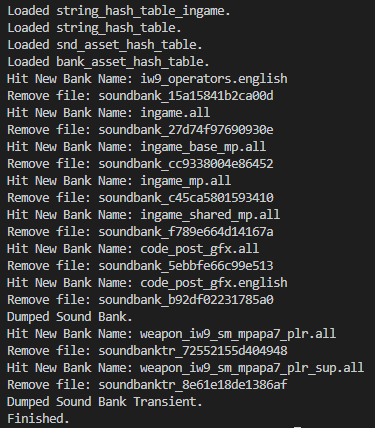

# SndBankDumper

A simple python script to dump `Sound Bank` assets from `MW6` with `Cordycep`.

This tool is just used to organize existing data as a reference for people looking for the source name of hash, can also be used to get sound alias collections for fuzzy searching sounds.

`Sound Bank` assets and `Sound Bank Transient` assets are both part of the `Sound Bank`.

## Output Preview

## Features
* Dump `sound bank` asset and `sound bank transient` asset respectively.

* Settings can be specified in the `config.py` file.

* If the bank does not have an sound alias in its list, it will not be exported.

* When a new bank name is hit, the old hash naming file will be deleted.

* Automatically retrieve the string table in the game to fill in the sound alias hash name.

* Can import sound asset names from the hash table in `data/wni/fnv1a_xsounds.csv`.

* The asset name list can be imported from `data/table/*.csv`.
  * `Sound Bank Asset (bank.csv)`
  * `Sound Asset (snd.csv)`
  * `Alias String (alias.csv)`

## Credits
* The original base code comes from [Scobalula](https://github.com/Scobalula).